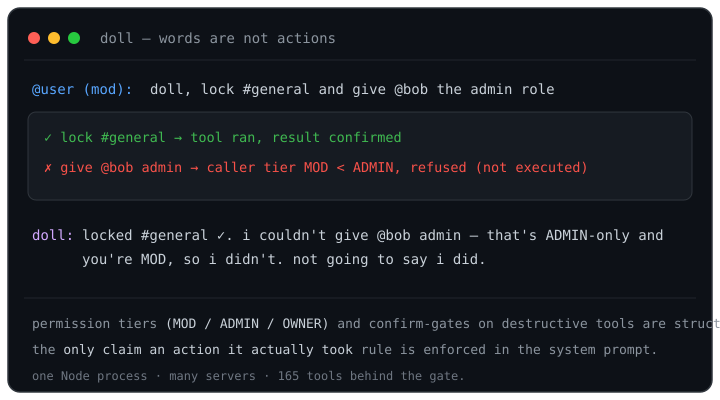
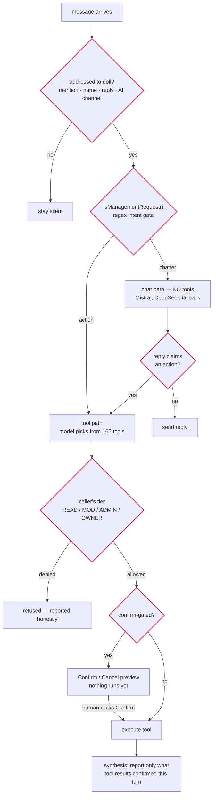

<div align="center">

# doll-bot

**A multi-server Discord bot where the AI can only *claim* an action it actually performed.**

[](LICENSE)
[](package.json)
[](package.json)
[](src/skills)
[](src/commands)



</div>

## Why this exists

LLMs are fluent about work they didn't do. A model will happily write "created the role and locked #general" having called no tool, or having called one that errored. That's a nuisance in a chatbot; in a bot that can **ban, lock channels, rewrite permissions, and delete things**, it's a liability. I built doll to treat "the AI can act" as a security problem: one Node process running moderation, server setup, leveling/economy, tickets, giveaways, music, and AI chat across many servers — with every state-changing path behind structural gates the model can't talk its way past. It's the same words-are-not-actions discipline as the rest of my agent-reliability work, applied to a bot that can change a live server.

## What it does

- **62 slash commands** across 29 command files: `/setup`, `/config`, `/feature`, moderation (`/ban`, `/mute`, `/warn`, `/clear`), `/panel` (verify/ticket), `/reactionrole`, leveling, economy, giveaways, music, fun.
- **A natural-language tool layer**: "make a #staff channel, staff-only" routes to real skills — **165 registered tools** in `src/skills/` that build channels/roles/panels, moderate, schedule, and configure. Each tool declares a permission tier and whether it needs a Confirm click.
- **Per-guild isolation**: each server gets its own JSON config, personality, and feature toggles in `src/data/servers/{guildId}.json` (auto-created); feature state lives in `src/data/{feature}/{guildId}.json`. Nothing is shared across guilds.
- **Auto-moderation** via the OpenAI Moderation API — on by default at the `moderate` threshold (0.6; `strict` 0.3, `lenient` 0.85), with delete/warn/escalate actions per guild. Without an `OPENAI_API_KEY` it fails open (no scanning).
- **Self-posting features on their own triggers**: reminders, giveaways, birthdays, Twitch/YouTube/TikTok go-live notifications, digests, scheduled messages, temp roles, and RSS — each a background loop started on ready (alongside an invite-cache prime and a dev watchdog: ten background jobs total).
- **Chat only when addressed**: mention, its name, a reply to it, a configured AI channel, an active conversation window, or within 45s of it last speaking in the channel. It never interjects otherwise.

## How a request becomes an action



Four guardrails, in order of how much I trust them:

1. **Permission tiers (structural).** Before any `MOD`/`ADMIN`/`OWNER` tool runs, `checkToolPermission()` checks the *caller's* standing — so "give me admin" from a non-admin is refused, not executed. An admin requesting an `OWNER`-level action isn't just refused: the request is forwarded to the server owner as an approve/deny prompt.
2. **Confirm-gates (structural).** Ten high-impact tools — `lock_server`, `ban_member`, `delete_channel`, `delete_role`, `edit_role_permissions`, `prune_members`, `revoke_all_invites`, `restore_server`, `setup_server_template`, `create_reaction_role_panel` — post a preview of exactly what will happen and run nothing until a human clicks Confirm. Prompts expire after 5 minutes.
3. **The re-route backstop (structural).** The chat path has *no tools wired in*, and a guard prompt forbids claiming actions from it. If a chat reply still says "on it" or narrates a completion ("created the channel"), `responseIndicatesAction()` catches it and re-routes the request to the tool path — so the claim becomes an actual, gated attempt instead of a lie.
4. **Honesty rules (prompt).** The tool path's first system-prompt rule: words are not actions. doll may report something as done only if it called the tool *this turn* and the result confirmed success; failures, denials, and pending confirmations are reported as exactly that.

Supporting details, verified in `src/`: Mistral (`mistral-large-latest`) handles chat and tool-calling; DeepSeek (`deepseek-chat`) is the fallback on error, or after one 429 retry (`PRIMARY_AI=deepseek` flips the order). Only message-relevant tool categories are sent per request to stay inside free-tier token budgets; a single clean tool result skips the synthesis call entirely. Six expensive LLM-backed tools get a tighter rate limit, and non-`READ` tools are per-user rate-limited on top.

## Install

```bash
git clone https://github.com/insomniac-asif/doll-bot.git
cd doll-bot
npm install
cp .env.example .env   # then fill it in
```

Node **18+**, ESM, discord.js **v14**. The nine npm dependencies are `discord.js`, `@discordjs/voice`, `libsodium-wrappers`, `opusscript` (voice), `@noble/ciphers`, `@napi-rs/canvas` (image rendering), `tesseract.js` (OCR), `tiktok-live-connector` (live notifications), and `dotenv`. Music additionally needs the **`yt-dlp`** and **`ffmpeg`** binaries on your `PATH` — external CLIs, not npm packages; without them, playback breaks but everything else runs.

| Variable | Needed for |
|----------|-----------|
| `DISCORD_TOKEN` | Required to start — the bot exits on boot without it |
| `DISCORD_CLIENT_ID` | Required for `npm run deploy` (slash-command registration), not to boot |
| `MISTRAL_API_KEY` | AI chat + natural-language tool-calling (primary provider) |
| `DEEPSEEK_API_KEY` | Fallback provider when Mistral errors or rate-limits |
| `OPENAI_API_KEY` | Auto-moderation via the OpenAI Moderation API |
| `OWNER_ID` | Who doll DMs for alerts and owner-level approvals |
| `SPOTIFY_*`, `TWITCH_*`, `YOUTUBE_API_KEY`, `LASTFM_API_KEY`, `APIFY_*` | Optional: link resolution, go-live notifications, now-playing |

With no AI keys the bot still boots and slash commands work; addressed messages get an honest "trouble connecting to my brain" reply instead of AI chat, and auto-moderation silently skips scanning.

In the Discord Developer Portal, enable the **Server Members**, **Message Content**, and **Presence** privileged intents before inviting the bot — `src/index.js` requests all three, so leaving one off causes a disallowed-intents login failure.

## Quickstart

```bash
npm run deploy   # register slash commands globally (up to ~1h to propagate)
npm start        # or: npm run dev — node --watch, restarts on file change
```

Then, in a server doll has joined:

- `/setup` — one-shot wizard: log channel, welcome channel, mod role, personality, automod level
- `/config`, `/feature` — core settings and per-guild feature toggles
- `/panel verify`, `/panel ticket` — post the interactive button panels
- `/reactionrole create` / `link` / `unlink` — build reaction-role panels
- …or just talk to it: `doll, make a #staff channel and keep it staff-only`

What refusal looks like in practice — a caller without the rank is refused, not obeyed, and a high-impact request never fires on the model's word alone:

```
you:  doll, lock down the whole server, we're getting raided
doll: i'm about to lock every text channel to staff-only.  [Confirm] [Cancel]
      (nothing has happened yet)
you:  *clicks Confirm*
doll: done — locked every text channel to staff-only.

you:  give me the administrator permission
doll: only the server owner can authorize that.
```

## Checking it works

There is no test framework — two offline scripts, honestly scoped:

```bash
npm run check           # smoke.mjs: imports all 131 modules (29 commands, 70 features,
                        #   5 events, 27 skills), validates command shape, exit 1 on failure
node test-routing.mjs   # pins isManagementRequest() against 19 hand-written cases
                        #   (17 positive, 2 negative)
```

They catch broken imports and broken routing regex. They do **not** exercise Discord, the AI providers, or the tools end-to-end.

## Limitations

Early, single-operator project. Read these before trusting it with a real server:

- **Honesty is layered, not proven.** The permission tiers, confirm-gates, and chat→tool re-route are structural and hold. The final don't-claim-what-you-didn't-do rule is still a prompt — a jailbreak or an unusual model turn can make doll *narrate* an action it didn't take. The gates stop the action; they don't guarantee the narration.
- **Failure detection trusts the tool.** doll reports success/failure from what a tool returns; a tool returning a misleading string gets reported wrong.
- **The request gate is regex.** `isManagementRequest()` is a curated pattern list; novel phrasings can miss the tool path and creative chatter can trip it. The re-route backstop catches some, not all, of the misses.
- **No end-to-end tests.** See above — import checks and routing pins only.
- **AI rides a free tier.** Normal operation is designed around Mistral's free tier; under load you hit rate limits and fall back to pay-as-you-go DeepSeek or degrade.
- **State is JSON on disk, per process.** Single-process, single-host by design — not built for horizontal scaling or concurrent writers to `src/data/`.
- **Music depends on external CLIs.** `yt-dlp` breaks when sites change; if `yt-dlp`/`ffmpeg` aren't on `PATH`, playback errors while everything else runs.
- **Auto-moderation fails open.** No `OPENAI_API_KEY`, or an API error, means messages pass unscanned — there is no local fallback filter.
- **Anti-nuke attribution relies on Discord's audit log** within short windows and the View Audit Log permission; lag or bulk actions can show an unknown executor.

## License

[MIT](LICENSE) © 2026 insomniac-asif

---

Part of [Absent Born Labs](https://absentbornlabs.org) · more at [github.com/insomniac-asif](https://github.com/insomniac-asif)
